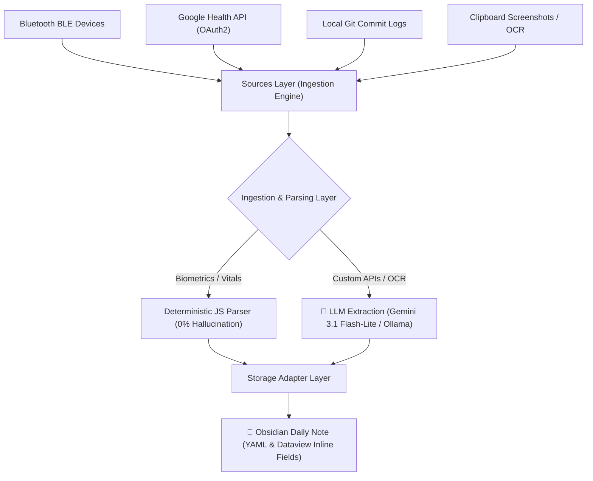

# Obsidian Omni-Logger

**Omni-Logger** is a local-first, modular data sync and ingestion framework for Obsidian. It simplifies the pipeline of capturing telemetry, parsing it using LLMs, and logging metrics directly into your daily journal notes.

Instead of writing custom scripts for every integration, Omni-Logger provides a standardized framework containing pre-configured default sources, an interactive API Connection Wizard, and a dedicated Bluetooth device manager.

---

## 🏗️ Architecture & Framework Flow

Omni-Logger operates across three decoupled layers:



1. **Sources Layer (Ingestion)**: Collects data from built-in or custom sources (APIs, BLE devices, local git folders, or clipboard screenshot OCR).
2. **Parsing & Ingestion Layer**: 
   - **Deterministic Bypasses**: For built-in Google Health biometrics (Sleep, HRV, Hydration, Nutrition), data is parsed locally in JavaScript using precise mathematical and timezone offset logic to ensure **100% accuracy and zero AI hallucinations**.
   - **LLM-Routed Extraction**: For custom HTTP APIs and clipboard OCR images, raw payloads are routed to **Google Gemini** or local offline **Ollama** models for fuzzy text extraction.
3. **Storage Adapter Layer (Obsidian Write)**: Maps the extracted key-value parameters into your Obsidian Daily Note (YAML Frontmatter properties, inline Dataview fields, or appended section logs).

---

## 🚀 Key Features

*   **Custom API Wizard**: Easily add any HTTP API connection. Supports custom endpoint methods, custom headers, and token/credential authentication types (None, API Key, OAuth 2.0).
*   **Modal BLE Device Manager**: Discover, pair, and configure Bluetooth Low Energy (BLE) devices (like smart rings or bands) using a background helper. Supports custom GATT / challenge-response handshakes and metrics parsing.
*   **Google Health Sync (Pre-configured)**: Built-in OAuth 2.0 connection to pull sleep, HRV, vitals, nutrition, and hydration biometrics. It parses the payloads programmatically, keeping unlogged metrics (like alcohol or protein) clean as `Empty` instead of overwriting them with zeros.
*   **Clipboard / OCR Ingestion**: Monitor your clipboard for screenshots (e.g., call logs, Lumosity workouts, fitness apps) and automatically parse and log metrics via Gemini or Ollama.
*   **Local Git Activity Logger**: Aggregates native `git log` commit history across configured local repositories in the background to log your daily developer progress.
*   **On-The-Fly Settings**: Adjust sync styles (Manual vs. Automatic polling) and frequencies on the fly from the settings registry. Changes are saved immediately to both plugin settings and vault metadata templates.

---

## 🛠️ Integration & Setup

### 1. Clone the Repository
Clone this repository directly into your Obsidian vault's plugins folder:
```bash
cd YourVault/.obsidian/plugins/
git clone https://github.com/jare0014/omni-logger.git
cd omni-logger
npm install
```

### 2. Configure Python Helpers
The background Bluetooth scanning and telemetry pulls use Python. Ensure the dependencies are installed:
```bash
pip install requests pillow
```

### 3. Setup Google Health API Credentials
To enable Fitbit and Google Health sync:
1. Go to the [Google Cloud Console](https://console.cloud.google.com/).
2. Create a project and enable the **Google Health API** (v4).
3. Configure your OAuth consent screen and add these scopes:
   - `https://www.googleapis.com/auth/googlehealth.sleep.readonly`
   - `https://www.googleapis.com/auth/googlehealth.health_metrics_and_measurements.readonly`
   - `https://www.googleapis.com/auth/googlehealth.nutrition.readonly`
   - `https://www.googleapis.com/auth/googlehealth.nutrition.writeonly`
4. Create an **OAuth Web Client ID** and set the redirect URL to:
   `http://localhost:8092`
5. In Obsidian Settings -> **Omni-Logger**, enter your Client ID and Client Secret, choose your sync scopes, and click **Connect Google Account**.

### 4. Creating Custom API Connections & Templates
1. Click **+ Add API Connection** in the Sources header.
2. Enter your endpoint, select the request method, configure headers, and choose the Authentication Type (None, API Key, or OAuth 2.0).
3. Scroll down to the templates registry at the bottom, select your newly added API connection, and click **+ Create New Template via LLM**.
4. Configure target fields and prompts, and it is ready to sync on the fly!

### 5. Pairing Bluetooth BLE Devices
1. Click **+ Pair BLE Device** in the Sources header.
2. Select your device from the discovered list, define a display name, and select advanced GATT handshakes if required.
3. Once paired, you can create a custom BLE template referencing this device to automatically log biometrics in the background.

---

## 🥗 Logging Food & Drinks

The food ingestion workflow uses Google Health as the single source of truth:
1. Add a Meta-Bind button in your daily note template:
   ```meta-bind-button
   label: 🥗 Log Food
   icon: salad
   style: primary
   action:
     type: command
     command: omni-logger:open-food-logger
   ```
2. Running **`Open Food Ingestion & Registry`** from the command palette or clicking the button lets you:
   - **Log Food**: Select a registered item (e.g. *Double Espresso*), input servings, and write it to Google Health.
   - **Add to Registry**: Register custom food items, default serving sizes, and nutritional macros (caffeine, alcohol, protein, and calories) to add them to your local registry (`health_go_to_items.json`).
